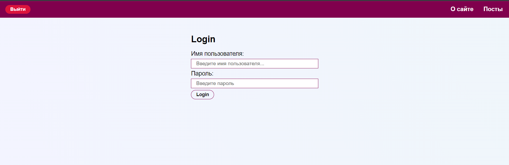
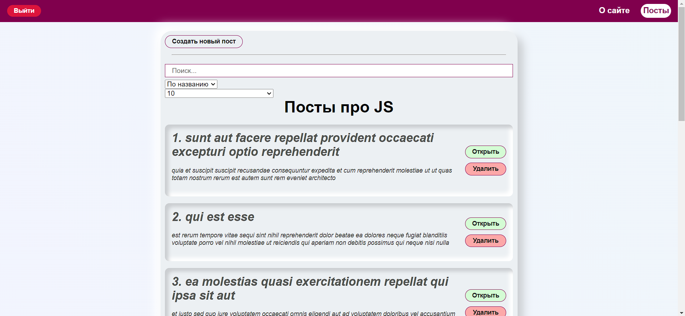
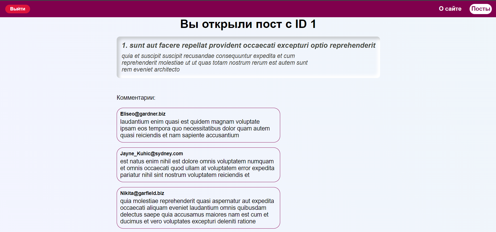
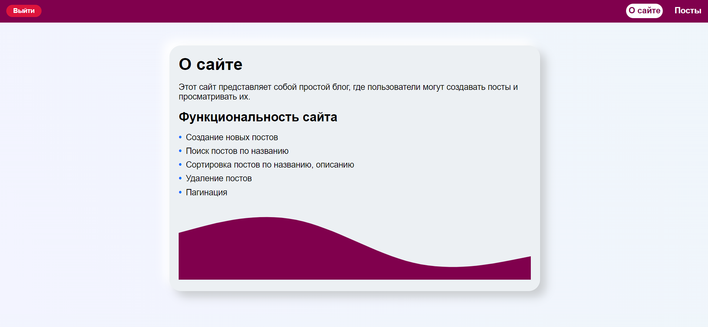

# Posts app
## Deploy: https://frodibjorn.github.io/postsApp/

## Studying project on react

(If a 404 error occurs, clear the localStorage and re-enter deploy)

## Installation

The following steps are required to install the project:

1. Clone the repository using the command: `git clone https://github.com/frodiBjorn/postsApp`.
2. Go to the project directory: `postsApp`.
3. Install necessary dependencies: `npm install`.

## Launch the project

Run the following command to start the project:
npm run start

After launching the project, you can open a browser and go to http://localhost:3000 to see the results.
